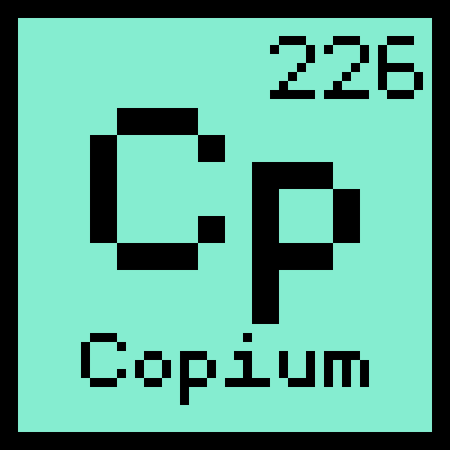

# Copium 226

A narrative serious game about renewable energies. Available on [itch.io](https://picarats.itch.io/copium-226)!

## About

George, a young man who recently graduated from a prestigious engineering school, comes back to his home village, Vitry-la-Vallée, located deep in a mountain range and isolated from the rest of the world.

Being in charge of the microscopic electrical network of his hamlet, George thought he'd be able to live the rest of his life in peace, surrounded by snow, sheeps and nature. But the discovery in an ancient mine of a new ore with incredible property, named Copium 226, threatens to turn upside down the life of this small village... 

**This game has been developed in 3 weeks, as part of a final year Computer Science project.**

## Getting started

[Node.js](https://nodejs.org) is required to install dependencies and run scripts via ``npm``.

1. Clone the repository ``git clone https://github.com/picarats/copium-226.git``

2. Run ``npm install`` from your project directory to nstall project dependencies

3. Build project using ``npm start``. You can edit any files in the */src* folder and webpack will automatically recompile and reload your server (available at http://localhost:3000 by default).

> (WIP) Bundle code builds with production settings (minification, uglification, etc) are made using ``npm run build``. Your code will be built into a single bundle located at */dist/bundle.min.js* along with any other assets you project depended. If you put the contents of the dist folder in a publicly-accessible location, you should be able to open it and play your game.

## Licensing/Credits

Copyright &copy; 2022 Copium-226. All rights reserved. Code is licensed under [GPL-3.0](LICENSE). Assets are licensed under [CC-BY-4.0](assets/LICENSE) unless specifically stated.

```
This program is free software: you can redistribute it and/or modify
it under the terms of the GNU General Public License as published by
the Free Software Foundation, either version 3 of the License, or
(at your option) any later version.

This program is distributed in the hope that it will be useful,
but WITHOUT ANY WARRANTY; without even the implied warranty of
MERCHANTABILITY or FITNESS FOR A PARTICULAR PURPOSE.  See the
GNU General Public License for more details.
```

All the songs are composed by [TAD](https://opengameart.org/users/tad) and are licensed under [CC-BY-4.0](assets/LICENSE).

Font is [monogram](https://datagoblin.itch.io/monogram), licensed under [CC0](https://creativecommons.org/publicdomain/zero/1.0).